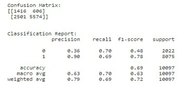

# Loan Prediction Challenge

* Laura Fernández Galindo: 
&nbsp;
[ LinkedIn](https://www.linkedin.com/in/laura-fern%C3%A1ndez-galindo-6113bb221/)
&nbsp;
[ GitHub](https://github.com/Laurafdez)

* Luis López Álvarez: 
&nbsp;
[ LinkedIn](https://www.linkedin.com/in/luis-l%C3%B3pez-%C3%A1lvarez-90ba57213/)
&nbsp;
[ GitHub](https://github.com/Luislopal)

* Álvaro de Rojas Maraver: 
&nbsp;
[ LinkedIn](https://www.linkedin.com/in/%C3%A1lvaro-de-rojas-maraver-42a4641b2/)
&nbsp;
[ GitHub](https://github.com/alvarodRM)

* Andrea Carballo Torres: 
&nbsp;
[ LinkedIn](https://www.linkedin.com/in/andrea-carballo-torres/)
&nbsp;
[ GitHub](https://github.com/AndreaCarballo)

* Pablo Rubio Noguera: 
&nbsp;
[ LinkedIn](https://www.linkedin.com/in/pablo-rubio-noguera-2ba646216/)
&nbsp;
[ GitHub](https://github.com/Pabloj20)

* Patricia Ortuño Otero: 
&nbsp;
[ LinkedIn](https://www.linkedin.com/in/patricia-ortu%C3%B1o-otero-55b102215/)
&nbsp;
[ GitHub](https://github.com/patriciaOrtuno28)

# License

<a href="LICENSE">LICENSE</a>

# Development

## Original Dataset

Given the following dataset, the aim is to predict whether a loan will be approved or not:

 

## Feature engineering

The data in the columns is modified to be treated as generalized groups represented as integers to avoid using categorical data, and avoid overfitting.

New columns are obtained to capture non-linear relationships between existing ones, and others are analyzed to understand their effect over the Accept column (the one to be predicted), such as ApprovalFY and the FranchiseCode:

## Final Dataset

The final dataset to train the model with has new columns such as if the loan was approved during the Recession.

 

## Correlation

## Geometric Models

### Logistic Regression

 

### SVM

 

### kNN

 

### Stacking

 

## GaussianNB

 

## Trees

### Random Forest

 

### XGBClassifier

 

## Neural Networks

 

